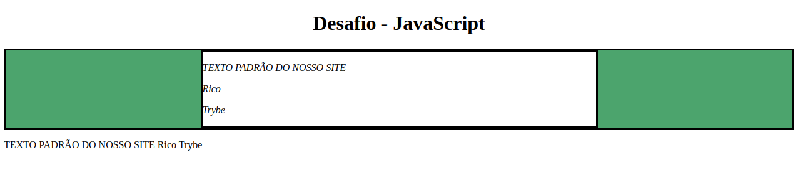

# README: DOM Manipulation



<br/>

In this project, I have started using JavaScript for DOM manipulation.

## Project Description

This project contains code that selects an HTML tag and changes its styles or content.

### Project Structure

The project consists of a single js file (`script.js`) and an some tests using cypress (`/cypress`).

### Technologies

- LINUX
- VSCODE
- JAVASCRIPT
- HTML
- CSS

### What I Learned

- How to change tag styles with javascript
- How to change tag content with javascript

## How to Run the Project

1. Clone the repository:

   ```bash
   git clone https://github.com/feduarte-dev/dom-manipulation
   ```

2. Navigate to the project directory:

   ```bash
   cd your-repository
   ```

3. Install dependencies:

   ```bash
   npm install
   ```

4. Right click index.html and open it with live server

## Contributions

[Felipe](https://www.linkedin.com/in/feduarte-dev/) - /script.js


[Trybe](https://www.betrybe.com/) - Everything else
